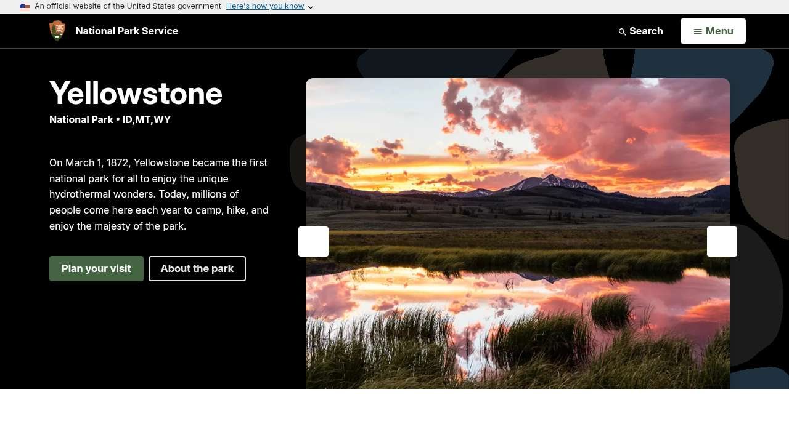
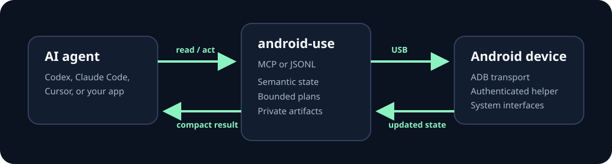

<p align="center"></p>

<h1 align="center">android-use</h1>
<p align="center"><strong>Give AI an Android device.</strong></p>
<p align="center">Connect a phone or tablet. Let your agent see the interface, use apps, control Chrome, and work with supported device capabilities through one small, local interface.</p>

<p align="center">
  <a href="docs/getting-started.md"><strong>Get started</strong></a> ·
  <a href="docs/README.md">Documentation</a> ·
  <a href="examples/README.md">Examples</a> ·
  <a href="docs/agents/quickstart.md">Agent setup</a> ·
  <a href="docs/reference/cli.md">CLI reference</a>
</p>

<p align="center">
  <a href="https://github.com/austinintelligence/android-use/actions/workflows/ci.yml"></a>
  <a href="LICENSE"></a>
  <a href="https://github.com/austinintelligence/android-use/releases"></a>
</p>

## Android, in the agent's toolbelt

Ask an agent to open an app, find a setting, enter text, read a page, or inspect device state. Android Use turns the visible interface into a compact semantic view, then accepts short generation-checked action plans. Screenshots and media stay behind private artifact handles instead of flooding the model context.



> **Real device demo:** Android Use selected a live Chrome tab over USB, navigated to the National Park Service, waited for “Yellowstone,” and returned this screenshot as a private artifact.

```text
You: Open Chrome, find Yellowstone, and show me the page.

Agent: ✓ Selected Chrome  ✓ Navigated  ✓ Verified “Yellowstone”
       Screenshot saved as a private artifact
```

## What it can do

| | Capability | What that means |
| --- | --- | --- |
| 👁 | **Understand the screen** | Read labels, controls, roles, and interaction references without processing a full screenshot every step. |
| 👆 | **Use Android apps** | Tap, type, scroll, press system keys, perform gestures, launch apps, wait, and verify. |
| 🌐 | **Control Chrome** | Inspect tabs and page structure, navigate, click, focus, type, scroll, reload, and capture a page. |
| 📱 | **Inspect the device** | Read readiness, supported capabilities, location, and notifications where Android permission is enabled. |
| 📷 | **Capture when asked** | Create bounded screenshots, camera images, microphone clips, and screen recordings when the device grants the required permission. |
| 🔌 | **Connect your agent** | Use two MCP tools—`android.read` and `android.act`—or the equivalent typed JSONL stream. |

[See the verified capability details →](docs/capabilities.md)

## Start in three steps

You need Android 8 or newer, a data-capable USB cable, and Windows, macOS, or Linux. Enable **Developer options → USB debugging** on Android first.

1. Download the release archive for your computer and extract it.
2. Connect and unlock one Android device. Approve the **Allow USB debugging?** prompt.
3. Run:

```console
au setup
```

Android Use installs its helper and opens the one Android setting it cannot approve for you:

```text
Settings → Accessibility → Android Use → On
```

Then confirm:

```console
au status
```

```text
Android Use is ready

✓ Android helper connected
✓ UI generation 402
✓ Capability mask 7
```

The release archive includes `au`, the Android helper, and the required Android platform tool. No Rust, Java, Gradle, or Android Studio is needed.

> Packages are published per platform. If your platform is not listed on the latest release, build from source; do not install an archive for a different operating system.

[Full human quickstart →](docs/getting-started.md) · [Troubleshooting →](docs/troubleshooting.md)

## Connect an AI agent

If your client supports MCP, configure it to run:

```console
au serve --mcp
```

The agent receives two tools:

- `android.read` observes Android, Chrome, capabilities, notifications, location, visuals, and private artifacts.
- `android.act` runs a short bounded plan against the generation the agent just observed.

Coding agents can start with [AGENTS.md](AGENTS.md). It contains the whole operating loop and recovery rules in one page. For Codex, Claude Code, Cursor, and similar clients, see the [Agent Quickstart](docs/agents/quickstart.md).

## How it works



Normal control stays between your computer and the enrolled device. The helper has no Android internet permission. Its local socket is reachable only through an Android Debug Bridge forward created for the selected device, and every session is authenticated. [Read the security model →](SECURITY.md)

## Choose your path

| I want to… | Start here |
| --- | --- |
| Let Codex, Claude Code, or Cursor use my Android device | [Agent Quickstart](docs/agents/quickstart.md) |
| Try commands myself | [Human Quickstart](docs/getting-started.md) |
| Build an agent integration | [Agent protocol](docs/reference/agent-protocol.md) |
| Automate a repeatable task | [Examples](examples/README.md) and JSONL |
| Understand permissions and remote-control risk | [Security](SECURITY.md) |
| Contribute to Android Use | [Development](docs/development.md) |

## FAQ

<details><summary><strong>Does Android Use include an AI model?</strong></summary><br>No. It gives an agent a safe, compact Android interface. Bring the agent or application you already use.</details>

<details><summary><strong>Does it work without screenshots?</strong></summary><br>Usually. Semantic UI is the preferred first read because it is smaller and identifies actionable controls. Use a screenshot when visual layout or imagery matters.</details>

<details><summary><strong>Does the phone need to be rooted?</strong></summary><br>No. Android Use relies on Android's normal debugging and user-granted accessibility or capability permissions.</details>

<details><summary><strong>Can it control any connected phone?</strong></summary><br>No. A server session is bound to one enrolled hardware identity. Android also asks you to trust the computer and separately controls sensitive permissions.</details>

<details><summary><strong>Can I use Wi-Fi instead of USB?</strong></summary><br>The current product enrolls an ADB endpoint, but release onboarding and validation use USB. Treat wireless ADB as an advanced Android transport and secure it as carefully as physical debugging access.</details>

<details><summary><strong>Where do captures and logs go?</strong></summary><br>Large captures are stored as local private artifacts. The operation journal stores bounded operation metadata, not screenshot or media contents. See <a href="SECURITY.md">Security</a> for paths, retention, and removal.</details>

## Project status

Android Use is an early open-source release. The typed interface, bounded execution model, helper authentication, Chrome control, and local artifact system are implemented and tested. Platform packages and optional Android capabilities may differ by release and device; `au doctor` is the authority for the connected setup.

MIT licensed. Contributions are welcome—start with [CONTRIBUTING.md](CONTRIBUTING.md).
