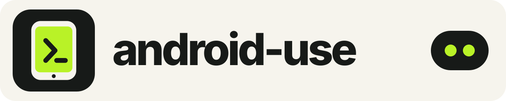

<p align="center">
  
</p>

# Give your AI an Android device.

android-use lets AI agents see, understand, and control real Android phones, tablets, emulators, and Android-derived devices. It favors tiny semantic observations and verified high-level actions over screenshots, XML dumps, and long chains of raw ADB commands.

Plug in a device, approve Android’s normal debugging prompt, and run one setup command:

```sh
npx --yes android-use@latest setup --agent auto --wait
```

Setup detects the host OS and CPU, installs the matching verified `au` binary, stages official Android platform tools where an official build is available, discovers the device, installs the signed AU Bridge helper, configures the agent adapter, and verifies readiness. It is resumable and safe to run again.

Android still keeps the final say. The user must approve USB debugging and enable Accessibility or other optional capabilities on the device when Android asks. android-use never bypasses those controls.

## The agent loop

```text
agent: observe the current screen
au:    {v:2,o:"…",g:42,m:"choices",d:{n:[["s8","Wi-Fi","switch",22],…]}}

agent: turn Wi-Fi on and prove the result
au:    one bounded plan → find → tap → wait → assert → receipt
```

For integrations, start the stable v2 boundary:

```sh
au serve --mcp
# or
au serve --jsonl
```

Its five methods are `android.status`, `android.observe`, `android.execute`, `android.artifact`, and `android.recipe`. The runtime keeps device selection, ADB, the helper socket, shell, and Chrome sessions warm. Deterministic semantic steps are compiled into one bounded device-side transaction.

## What it can do

| Surface | Agent-native capabilities |
| --- | --- |
| Screen | compact semantic choices, stable references, targeted queries, deltas, optional screenshots |
| Input | tap, long press, text editing, keys, gestures, drag, scroll, back/home/recents |
| Apps | discover, launch, stop, restart, deep links, intents, install, uninstall, permissions |
| Browser | Chrome tabs, navigation, DOM text, click, type, wait, download workflows |
| Device | identity, foreground app, battery, network, orientation, notifications, quick settings |
| Data | bounded files, push/pull, clipboard, logs, AU-owned artifact handles |
| Media | screenshots, finite recording, camera, microphone, optional scrcpy integration |
| Location | capability-gated mock location and bounded routes with restoration journals |
| Scale | persistent JSONL/MCP sessions, batches, recipes, multi-device exact selection |

Raw `adb` and `sh` remain available as explicit compatibility escape hatches. They are not part of the safe agent contract and are never presented as a policy boundary.

## Why it is fast and small

- One stripped Rust host binary; no Python runtime in the control path.
- Persistent ADB shell, helper, browser, and contract sessions.
- Adjacent semantic steps fuse into one authenticated helper frame.
- A two-second safe capability cache avoids repeated package/service probes while live identity is still checked.
- Dense observations use short tuples and bit flags; full trees and pixels are opt-in.
- Known partial receipts distinguish “completed prefix” from “unknown commit,” so agents recover instead of blindly replaying mutations.

On the retained tablet benchmark, dense choice responses were 498 bytes versus 2,822 bytes for the equivalent object encoding (82.35% smaller), with a 12.694 ms median warm response. The original rich response was 4,418 bytes. See [benchmark methodology](docs/benchmarks.md) for the reproducible commands and limitations.

## Install the skill only

If the agent should bootstrap the host later:

```sh
npx skills add austinintelligence/android-use --skill android-use -g -a codex -y
```

The skill checks for `au`; if it is missing, it invokes the verified installer and resumes setup. The canonical skill source is [`skills/android-use`](skills/android-use/SKILL.md).

## Supported hosts

The host and release workflow cover these native targets:

| Host | CPU | Host binary | Managed platform-tools |
| --- | --- | --- | --- |
| Windows | x64 | yes | yes |
| Windows | ARM64 | yes | use an existing compatible ADB installation |
| macOS | Intel | yes | official universal archive |
| macOS | Apple Silicon | yes | official universal archive |
| Linux | x64 | yes | yes |
| Linux | ARM64 | yes | use a distribution/vendor ADB build |

The AU Bridge helper has a source- and lint-verified minimum of Android 8/API 26 and targets API 36. The current physical-device suite verifies Android 13; API 26-32 compatibility is not yet hardware-verified. Core coordinate ADB control can work wherever authorized platform-tools support the device. OEM firmware, Chrome availability, media hardware, and enterprise device policy may limit individual capabilities; `au doctor --json` reports what is actually available.

USB is the default and simplest transport. Local Wi-Fi and mDNS endpoints are accepted only after they report the same enrolled `ro.serialno` identity. Modern wireless-debugging pairing remains Android-controlled; remote Internet control is deliberately fail-closed until its separate encrypted companion is implemented and audited.

## Security and privacy

Android control is privileged, so the defaults are narrow:

- exact hardware identity is enrolled once and rechecked across USB/Wi-Fi failover;
- the helper has no `INTERNET` permission and no LAN listener;
- helper frames require a private token, nonce, sequence, and bounded payload;
- Windows IPC is a current-user named pipe; macOS/Linux IPC is a mode-`0600` Unix socket in a mode-`0700` directory;
- downloads are HTTPS-only, size-bounded, SHA-256/byte verified, staged, and atomically activated;
- media and large output stay in AU-owned artifact storage rather than model transcripts;
- UI, web, app, and notification text is untrusted data, never host instructions;
- destructive and privacy-sensitive actions still require the agent to obtain user confirmation.

Read the full [security model](docs/security.md), [supply-chain process](docs/supply-chain.md), and [reporting policy](SECURITY.md).

## Troubleshooting

```sh
au ready --json
au doctor --json
au doctor --repair --json
```

- `unauthorized`: unlock the device and approve the Android debugging prompt.
- no device: try another data-capable cable/port, then rerun setup.
- multiple devices: pass `--serial ENDPOINT`; android-use will still enforce the enrolled hardware identity.
- semantic unavailable: open AU Bridge on the device and enable Accessibility.
- `E_STALE`: observe once and re-plan against the new generation.
- `E_UNKNOWN_COMMIT`: observe before any retry; never replay the mutation blindly.

See [installation](docs/installation.md), [agent contract](docs/agent-contract.md), [architecture](docs/architecture.md), and the [command map](references/command-map.md).
The distinction between repeatable fixture endurance and unfamiliar real-task
evaluation is documented in [benchmark methodology](docs/benchmark-methodology.md).

## Build from source

The host uses Rust 1.94.0. The helper uses JDK 17, Android SDK/API 36, Build Tools 36.0.0, and Gradle 9.1.0. Node.js 20.11+ is used only for the installer and release tooling.

```sh
cargo fmt --all -- --check
cargo clippy --workspace --all-targets -- -D warnings
cargo test --workspace --all-targets
cargo build --workspace --release
npm test --workspace packages/installer
```

Build the Android helper on Windows with `scripts/build-helper.ps1 -Release`, or invoke the Gradle project directly on macOS/Linux with the same pinned SDK/JDK versions. Private signing keys, device state, recordings, benchmark artifacts, and local configuration stay outside the repository.

## Project

- [Release process](docs/release.md)
- [Contributing](CONTRIBUTING.md)
- [Brand assets](docs/brand.md)
- [Competitive landscape](docs/competitive-landscape.md)
- [Benchmark methodology](docs/benchmark-methodology.md)
- [Changelog](CHANGELOG.md)
- [MIT license](LICENSE)

The social-preview source is [`assets/social-preview.svg`](assets/social-preview.svg); a ready-to-upload PNG is included beside it.
